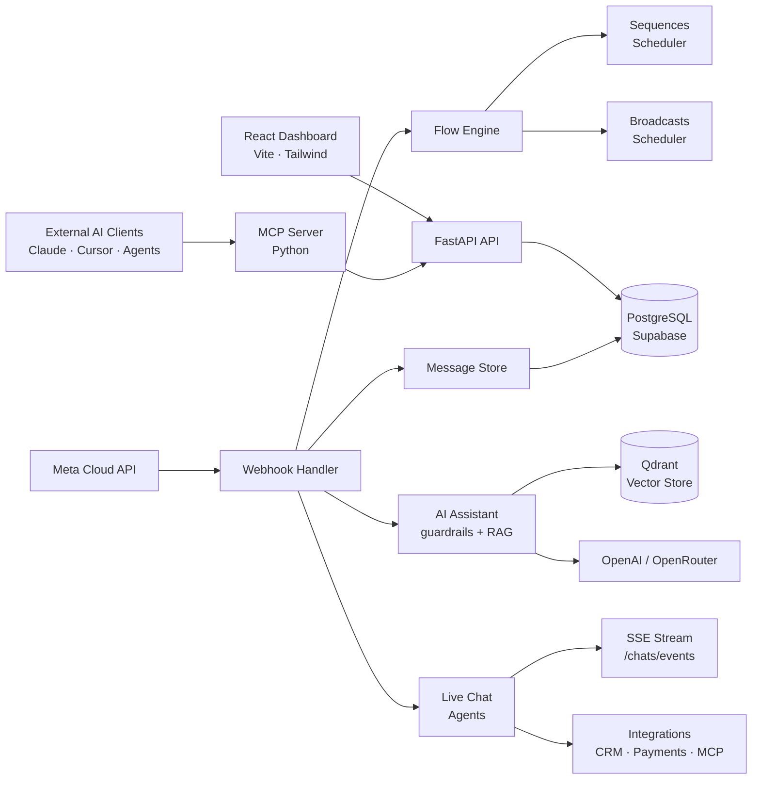

<div align="center">

```
███████╗ █████╗ ██████╗ ██████╗  ██████╗ ████████╗
╚══███╔╝██╔══██╗██╔══██╗██╔══██╗██╔═══██╗╚══██╔══╝
  ███╔╝ ███████║██████╔╝██████╔╝██║   ██║   ██║
 ███╔╝  ██╔══██║██╔═══╝ ██╔══██╗██║   ██║   ██║
███████╗██║  ██║██║     ██████╔╝╚██████╔╝   ██║
╚══════╝╚═╝  ╚═╝╚═╝     ╚═════╝  ╚═════╝   ╚═╝
```

### **Full-Stack WhatsApp SaaS Platform**
*Automate. Support. Integrate. Scale — on the world's largest messaging channel.*

---

[](https://nodejs.org/)
[](https://react.dev/)
[](https://supabase.com/)
[](https://qdrant.tech/)
[](https://platform.openai.com/)
[](https://modelcontextprotocol.io/)
[](https://www.terraform.io/)
[](https://docs.docker.com/compose/)
[](https://github.com/features/actions)
[](LICENSE)

</div>

---

## What is ZapBot?

**ZapBot** is a production-grade, modular WhatsApp SaaS platform engineered for organizations that need more than a chatbot. It covers the full operational stack: automated conversation flows, live agent support, an AI assistant with enterprise-grade guardrails, RAG-powered context, external integrations, and a Python MCP server that lets any AI client — Claude, Cursor, or custom agents — operate WhatsApp programmatically through a scoped, authenticated API.

```
┌────────────────────────────────────────────────────────────────────────────┐
│                              ZAPBOT PLATFORM                               │
│                                                                            │
│   RECEIVE ──► ROUTE ──► AUTOMATE ──► ASSIST ──► INTEGRATE ──► RESPOND     │
│                                                                            │
│   Webhook     Flow       Sequences    AI + RAG    CRM · MCP    WhatsApp    │
│   ingest      engine     broadcasts   guardrails  payments     Cloud API   │
└────────────────────────────────────────────────────────────────────────────┘
```

> The root Express application is the current MVP. The multi-service prototype in `backend/services/` is preserved as reference only.

---

## Architecture



### Layer Breakdown

| Layer | Technology | Responsibility |
|---|---|---|
| **Frontend** | React 18 · Vite · Tailwind · Command Palette | Dashboard, live chat UI, automation management |
| **API Server** | Node.js · Express · Sequelize ORM | REST endpoints, webhook, orchestration |
| **Webhook Handler** | `webhookHandler.js` | Parses Meta payloads, persists events and messages |
| **Flow Engine** | `flowEngine.js` | Interprets JSON-defined conversation flows |
| **Schedulers** | `tasks/` · node-cron | Drip sequences and broadcast execution |
| **AI Assistant** | `ai/assistant.js` | Guardrails, intent classification, RAG context |
| **Vector Search** | Qdrant · pgvector | Document indexing and semantic retrieval |
| **Persistence** | PostgreSQL · Supabase (SQLite for local dev) | All platform data |
| **Integrations** | `integrations/` | CRM, payments, REST, GraphQL, external MCP |
| **MCP Server** | Python · JSON-RPC | Programmatic WhatsApp access for AI clients |
| **Infrastructure** | Terraform · AWS · Docker Compose | Cloud provisioning and container runtime |
| **CI/CD** | GitHub Actions | Automated test and deployment pipeline |

---

## Quick Start

### 1 — Clone & Configure

```bash
git clone https://github.com/maykonlincolnusa/zapbot.git
cd zapbot
copy .env.example .env
```

### 2 — Install Dependencies

```bash
npm install
npm install --prefix frontend
```

### 3 — Start the Platform

```bash
npm run dev
```

| Service | URL |
|---|---|
| **Frontend Dashboard** | http://localhost:5173 |
| **API** | http://localhost:3000 |

### 4 — First Admin

Register through the UI, or seed the initial admin via `.env`:

```bash
ADMIN_NAME=
ADMIN_EMAIL=admin@example.local
ADMIN_PASSWORD=your-local-password
```

---

## AI Assistant — Guardrail Pipeline

The internal assistant in `ai/assistant.js` is not a plain LLM wrapper. Every inbound message runs through a sequential safety and enrichment pipeline before a response is generated:

```
Inbound Message
      │
      ▼
┌─────────────────────┐
│  PII Detection      │  ← Strip personal data before any model call
└────────┬────────────┘
         │
         ▼
┌─────────────────────┐
│  Jailbreak Check    │  ← Classify and block adversarial prompts
└────────┬────────────┘
         │
         ▼
┌─────────────────────┐
│  Moderation Layer   │  ← Optional OpenAI content moderation
└────────┬────────────┘
         │
         ▼
┌─────────────────────┐
│  Intent Classifier  │  ← Route to flow, agent, or AI response
└────────┬────────────┘
         │
         ▼
┌─────────────────────┐
│  RAG Context        │  ← Inject relevant document chunks (Qdrant)
└────────┬────────────┘
         │
         ▼
┌─────────────────────┐
│  LLM Response       │  ← OpenAI / OpenRouter (configurable model)
└─────────────────────┘
```

---

## MCP Server

ZapBot ships a Python MCP server (`mcp-server/`) that exposes platform capabilities to any MCP-compatible AI client — Claude, Cursor, or custom agents — without ever sharing Meta credentials externally.

```
External AI Client (Claude / Cursor / Agent)
         │
         │  JSON-RPC  tools/list · tools/call
         ▼
┌─────────────────────────┐
│   Python MCP Server     │
│   mock backend          │  ← Safe local dev and testing
│   live backend          │  ← Calls platform REST API
└──────────┬──────────────┘
           │
           ▼
┌─────────────────────────┐
│   Platform API          │  ← Scoped, authenticated
│   /api/mcp/*            │
└──────────┬──────────────┘
           │
           ▼
    WhatsApp Cloud API
```

### Setup

```bash
python -m venv .venv
.venv\Scripts\pip install -r requirements.txt
```

**Mock backend** (local dev):

```bash
set MCP_BACKEND=mock
.venv\Scripts\python mcp-server\main.py
```

**Live backend** (production):

```bash
set MCP_BACKEND=live
set ZAPBOT_API_BASE_URL=http://localhost:3000
set ZAPBOT_API_TOKEN=your-service-token
.venv\Scripts\python mcp-server\main.py
```

### Register in MCP Clients

```json
{
  "mcpServers": {
    "zapbot-ai-whatsapp": {
      "command": "python",
      "args": ["mcp-server/main.py"],
      "env": {
        "MCP_BACKEND": "live",
        "ZAPBOT_API_BASE_URL": "http://localhost:3000",
        "ZAPBOT_API_TOKEN": "your-service-token"
      }
    }
  }
}
```

### Available MCP Tools

| Endpoint | Method | Description |
|---|---|---|
| `/api/mcp/tools` | GET | List available tools |
| `/api/mcp/contacts/search` | GET | Search contacts by query |
| `/api/mcp/contacts` | POST | Create a contact |
| `/api/mcp/chats` | GET | List all chats |
| `/api/mcp/chats/:id` | GET | Get a specific chat |
| `/api/mcp/chats/:id/messages` | GET | Get chat messages |
| `/api/mcp/messages` | POST | Send a WhatsApp message |
| `/api/mcp/files` | POST | Upload a file |

---

## API Reference

### Authentication

```http
POST /api/auth/register
POST /api/auth/login
GET  /api/auth/me
```

---

### Automation

```http
GET  /api/contacts
POST /api/contacts

GET  /api/automation/flows
POST /api/automation/flows
POST /api/automation/flows/:id/start

GET  /api/automation/sequences
POST /api/automation/sequences
POST /api/automation/sequences/:id/enroll

GET  /api/automation/transmissions
POST /api/automation/transmissions
POST /api/automation/transmissions/:id/start
```

---

### Live Support

```http
GET  /api/chats?filter=all|mine|unassigned
GET  /api/chats/:id
GET  /api/chats/:id/messages
POST /api/chats/:id/claim
POST /api/chats/:id/unclaim
POST /api/chats/:id/messages
GET  /api/chats/events?token=<jwt>        # SSE live stream
```

---

### Integrations

```http
GET  /api/integrations
GET  /api/integrations/servers
POST /api/integrations/servers
POST /api/integrations/servers/:id/discover
POST /api/integrations/servers/:id/invoke
POST /api/integrations/crm/sync-contact
POST /api/integrations/payments/link
POST /api/integrations/rest
POST /api/integrations/graphql
```

---

## Configuration

### Core

```bash
PORT=3000
DATABASE_URL=                             # Empty = SQLite local dev
SQLITE_PATH=./data/zapbot-ai.sqlite
JWT_SECRET=replace-with-long-secret
SERVICE_TOKEN=replace-with-long-token
API_INTEGRATION_KEY=dev-api-key
```

### WhatsApp Cloud API

```bash
WHATSAPP_VERIFY_TOKEN=webhook-verify-token
WHATSAPP_API_TOKEN=whatsapp-cloud-api-token
WHATSAPP_PHONE_NUMBER_ID=phone-number-id
WHATSAPP_GRAPH_VERSION=v20.0
```

Configure the Meta webhook URL as:

```
https://your-domain.com/webhook
```

For local development, use an HTTPS tunnel pointing to `http://localhost:3000/webhook`.

### AI Provider

```bash
OPENAI_API_KEY=your-openai-key
OPENAI_MODEL=gpt-4o-mini
OPENAI_AUTO_REPLY=true
OPENAI_MODERATION_ENABLED=false

OPENROUTER_API_KEY=your-openrouter-key
OPENROUTER_DEFAULT_MODEL=openai/gpt-4o-mini
```

### Vector Search

```bash
QDRANT_URL=
QDRANT_API_KEY=
QDRANT_COLLECTION=zapbot_documents
```

---

## Database

### Local Development (SQLite)

Leave `DATABASE_URL` empty. ZapBot auto-creates an SQLite database at `SQLITE_PATH`.

### Production (Supabase / PostgreSQL)

1. Create a project on [Supabase](https://supabase.com).
2. Copy the PostgreSQL connection string into `DATABASE_URL`.
3. Set `DB_SSL=true`.
4. Start the API — Sequelize creates all tables automatically.
5. Run `docs/supabase.sql` for extra indexes, pgvector, and optional RLS policies.

---

## Infrastructure

ZapBot ships with a production-ready infrastructure layer:

```
infra/
└── aws/
    └── terraform/     # AWS provisioning (VPC, ECS, RDS, etc.)

.github/
└── workflows/         # GitHub Actions CI/CD pipeline

Dockerfile             # Production image
Dockerfile.mvp         # Lightweight MVP image
docker-compose.yml     # Full stack orchestration
docker-compose.postgres.yml   # PostgreSQL-only variant
```

---

## Project Structure

```
zapbot/
├── ai/
│   ├── assistant.js           # AI guardrails + RAG pipeline
│   └── platformAssistant.js   # Contextual platform help
├── backend/
│   └── services/              # Legacy multi-service prototype (reference only)
├── config/                    # App configuration
├── design systems/            # UI design tokens and system docs
├── docs/
│   └── supabase.sql           # Indexes, pgvector, RLS policies
├── examples/
│   ├── flow.sample.json       # Flow definition example
│   ├── sequence.sample.json   # Sequence definition example
│   └── transmission.sample.json
├── frontend/                  # React + Vite dashboard
├── infra/aws/terraform/       # AWS Terraform modules
├── integrations/              # CRM, payments, REST, GraphQL, MCP client
├── mcp-server/                # Python MCP server
├── middleware/                # Express middleware
├── models/                    # Sequelize ORM models
├── routes/                    # REST route modules
├── scripts/                   # Utility scripts
├── tasks/                     # Sequence and broadcast schedulers
├── tests/                     # Test suite
├── flowEngine.js              # JSON flow interpreter
├── rag.js                     # Qdrant RAG scaffold
├── server.js                  # Express entrypoint
├── webhookHandler.js          # Meta webhook parser
└── whatsapp.js                # WhatsApp Cloud API helpers
```

---

## Local Development

**Run only the API:**

```bash
npm start
```

**Run validations and tests:**

```bash
npm run check
npm test
npm run build:frontend
```

**Customize the product name:**

```bash
VITE_PROJECT_NAME=MyProduct
DEFAULT_WORKSPACE_NAME=MyProduct Demo
```

---

## Production Notes

Before exposing the service to production traffic:

- Rotate `JWT_SECRET`, `SERVICE_TOKEN`, admin credentials, and all API keys.
- Enforce HTTPS for the Meta webhook and MCP live backend.
- Respect WhatsApp opt-in, opt-out, and template policies before large broadcast campaigns.
- Add per-connector allowlists before opening generic REST/GraphQL to untrusted users.
- Store only scoped tokens for external MCP integrations (`tools/list` and `tools/call`).
- Replace `node-cron` with a durable queue (e.g. BullMQ, SQS) as broadcast and sequence volume grows.
- Complete embedding generation in `rag.js` before depending on RAG quality in production.

---

## License

Distributed under the [MIT License](LICENSE).

---

<div align="center">

**ZapBot** — *Every conversation automated. Every customer covered. Every integration connected.*

</div>
